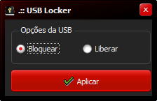

# bloqueiaUSB

>Bloqueador de portas USB para sistema operacional Windows.

Um pequeno aplicativo para facilitar o bloqueio de portas USB do computador, o bloqueio é feito através do registro do Windows.

Interface com senha ao abrir o aplicativo.

Interface para Bloquear/Liberar as portas USB do dispositivo.

